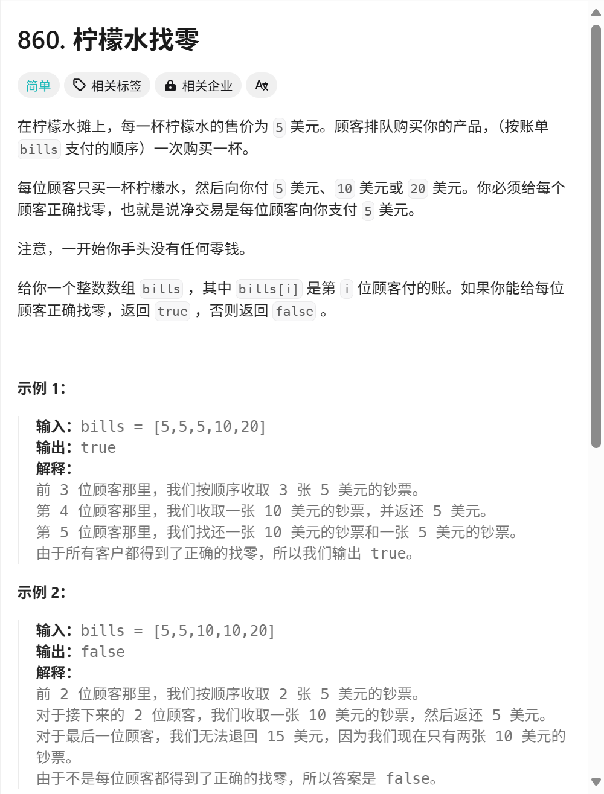

## 

### 第一次尝试
```C++
class Solution {
public:
    bool lemonadeChange(vector<int>& bills) {
        vector<int> v_(2,0);
        // 给我 20 我至少 ( 1 10 1 5 ） （3 5） 
        // 给我 10 我至少 （1 5）
        // 给我5 最好
        for(auto a:bills)
        {
            if(a==5)
            {
                v_[0]++;
            }
            else if(a==10)
            {
                if(v_[0]==0)
                {
                    return false;
                }
                else
                {
                    v_[0]--;
                    v_[1]++;
                }
            }
            else
            {
                if(v_[1]==0)
                {
                    if(v_[0]>=3)
                    {
                        v_[0]-=3;
                    }
                    else
                    {
                        return false;
                    }
                }
                else
                {
                    if(v_[0]>=1)
                    {
                        v_[0]--;
                        v_[1]--;
                    }
                    else
                    {
                        return false;
                    }
                }
            }
        }
        return true;
    }
};
```


### 示例做法

